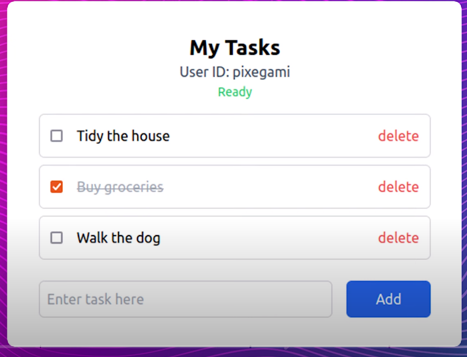
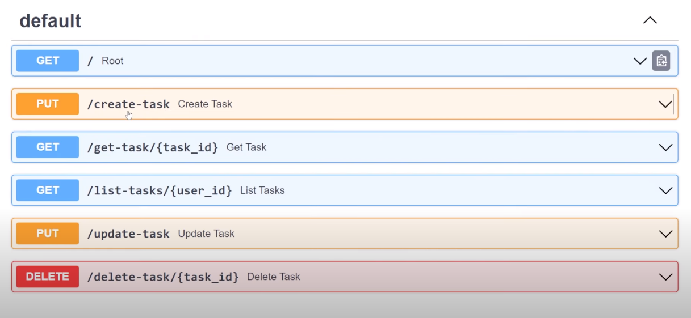
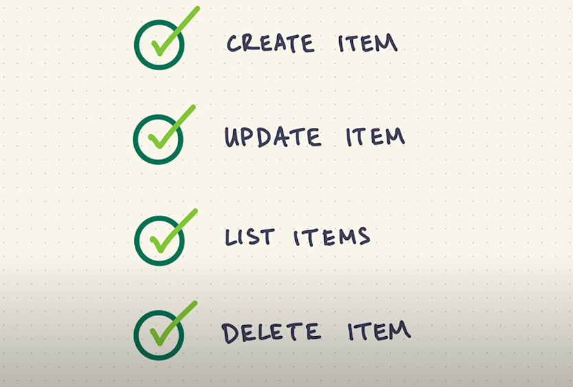
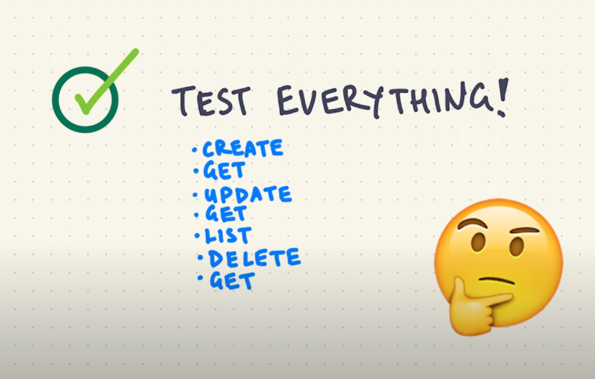
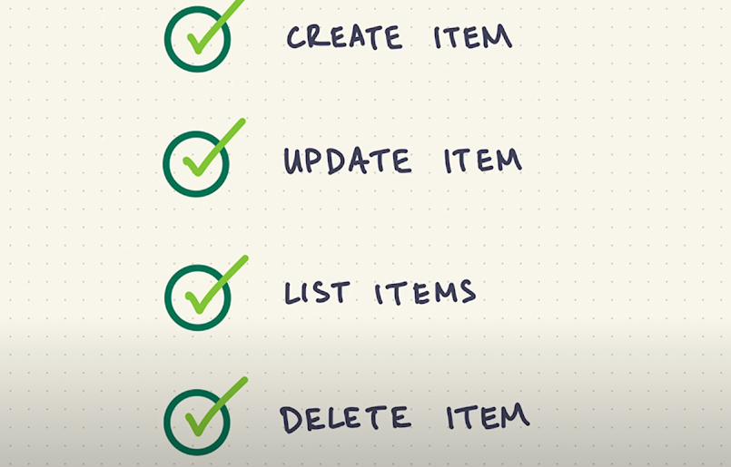
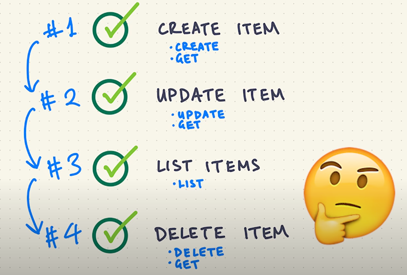
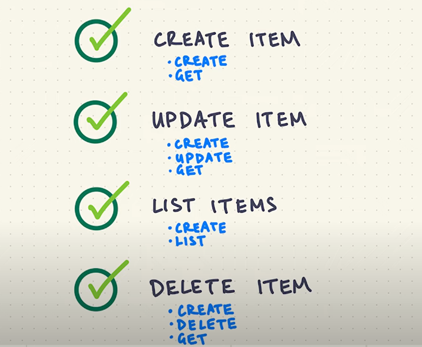

$ pip allure-commandline
$ pip install selenium
$ pip install allure-behave
$ pip install allure-pytest
$ pip install pytest-allure-adaptor
$ pip uninstall behave
$ pip3 install behave

Запустить отчёт/Run report:
$ behave -f allure_behave.formatter:AllureFormatter -o test_results/ features/
Загрузить отчёт/Upload report to browser:
$ allure serve test_results/

Если проблема: behave: error: format=allure_behave.formatter:AllureFormatter is unknown.
$ pip install --upgrade pip
pip install allure-behave
behave -f allure_behave.formatter:AllureFormatter -o %allure_result_folder% ./features

Сборка html-отчета на локальной машине

Для сборки html–отчета необходима утилита, которая называется allure–commandline. Получить отчет можно несколькими способами:

Способ 1:
1. Скачать последнюю версию allure–commandline по ссылке;

2. Распаковать архив;

3. Добавить путь до директории bin из распакованного архива в системную переменную окружения.

Чтобы убедиться в корректности установки, выполните в командной строке команду

allure --version

Должно появиться сообщение вида:

$ allure --version
2.6.0

После установки allure–commandline откройте в проводнике папку с исходными для построения отчета файлами 
(в нашем примере target/allure-results) и в окне команд (терминале) выполните команду

allure serve

После этого должен сформироваться сам html–отчет, который откроется в браузере по умолчанию автоматически.

C:\Webdrivers\allure-2.13.0\bin>allure --version
2.13.0
C:\Webdrivers\allure-2.13.0\bin>allure serve
Generating report to temp directory...
allure-results does not exists
Report successfully generated to C:\Users\GUROVV~1\AppData\Local\Temp\1112192896526047821\allure-report
Starting web server...
2019-11-19 23:17:38.593:INFO::main: Logging initialized @9785ms to org.eclipse.jetty.util.log.StdErrLog
Server started at <http://192.168.56.1:53498/>. Press <Ctrl+C> to exit

http://192.168.56.1:53498/index.html

##########
1. Just provoke Jenkins;
2. Create requirements.txt: pip freeze > requirements.txt
3. Define path to modul: which python3
4. Renew requirements.txt: pip install --upgrade -r requirements.txt

##########
Renew git to the latest version
git update-git-for-windows

##########
Ignore some file/s when committing/pushing
npm install touch-cli -g
touch .gitignore
Write in the body of the .gitignore names of the files you want to exclude from committing and pushing to GitHub

##########
# ran in parallel, you need to be in the same directory where there are files you are going to run
python 001_main_page_text_here.py & 002_main_page_logo_here.py & 003_main_page_phone_here.py & 004_address_here.py 
& 005_email_here.py & 006_search_product.py & 007_shopbybrand_numbers_oneshot.py & 008_captcha_works.py & 009_checkout_buy.py 
& 010_cart_is_emthy.py & 011_shop_by_brands_have_nine_submenu.py & 012_cart_has_one_item.py & 013_register_and_enter.py & 014_payments_logopics_here.py          
# ran one after another, you need to be in the same directory where there are files you are going to run
python 001_main_page_text_here.py;002_main_page_logo_here.py;003_main_page_phone_here.py;004_address_here.py;005_email_here.py;
006_search_product.py;007_shopbybrand_numbers_oneshot.py;008_captcha_works.py;009_checkout_buy.py;010_cart_is_emthy.py;
011_shop_by_brands_have_nine_submenu.py;012_cart_has_one_item.py;013_register_and_enter.py;014_payments_logopics_here.py

##########
# Create requirements.txt
pip freeze > requirements.txt
# Update requirements.txt
pip install -r requirements.txt --upgrade

##########
# retrieve the version of Selenium currently installed, from Python
python -c "import selenium; print(selenium.__version__)"

##########
Вебхук/ГитХаб побежден. 
Ход: при генерации урла в утилите ngrok нужно посылать команду  местного урла полностью 
http 192.168.12.130:8080, а не ngrok http 8080, тогда генерится урл/вебхук принимаемый 
ГитХабом: https://4d30-2607-fb90-9b95-b3e4-e9cd-c44f-a4ec-7f53.ngrok.io. 
Добавляем к нему /github-webhook/ и готово: 
https://4d30-2607-fb90-9b95-b3e4-e9cd-c44f-a4ec-7f53.ngrok.io/github-webhook/

##########
Allure with Jenkins
https://www.youtube.com/watch?v=Zf7CJUSW5DA
https://www.qaautomation.co.in/2018/12/allure-report-integration-with-jenkins.html

##########
adb
adb start-server
adb kill-server
adb devices

##########
behave --verbose

##########
PyTest requires its files to be named with the prefix test_ or _test_.
👉 Testing Endpoint: https://todo.pixegami.io/

📚 Resources
🔗 Install PyTest: https://docs.pytest.org
🔗 Install Requests: https://requests.readthedocs.io
HTTP response status codes: https://developer.mozilla.org/en-US/docs/web/http/status
# Test plan

